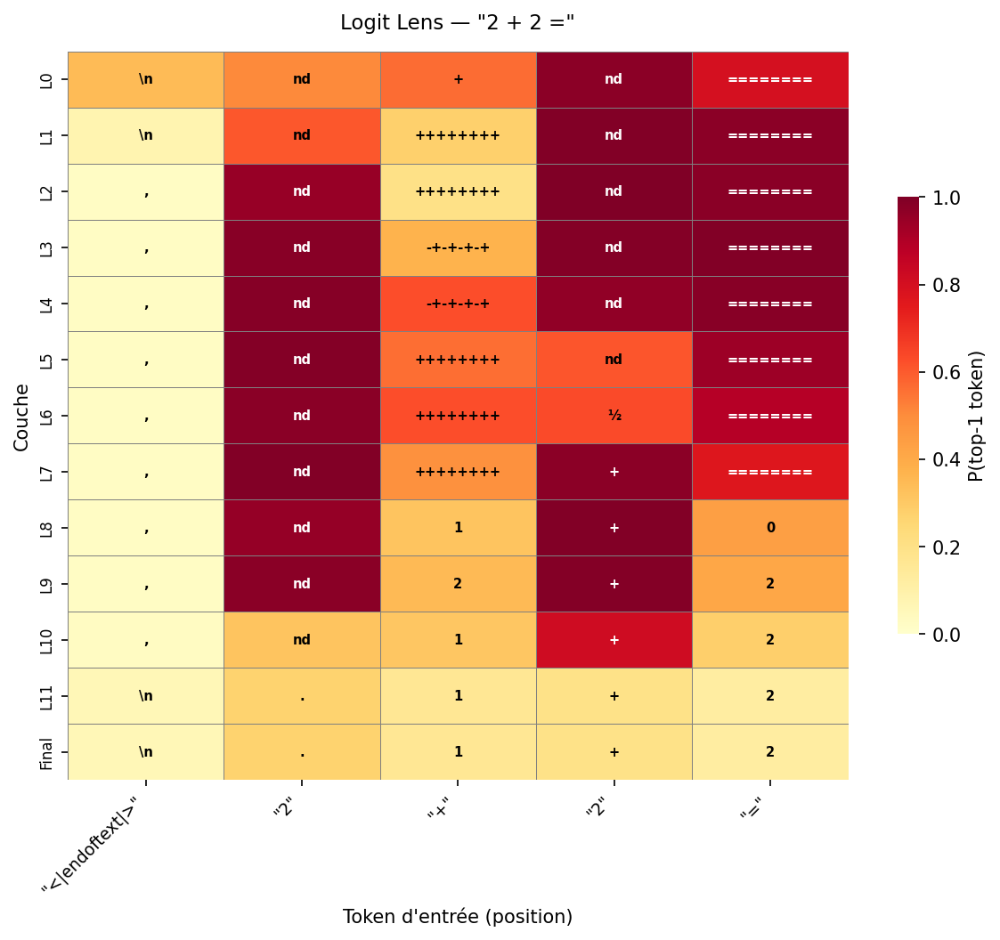
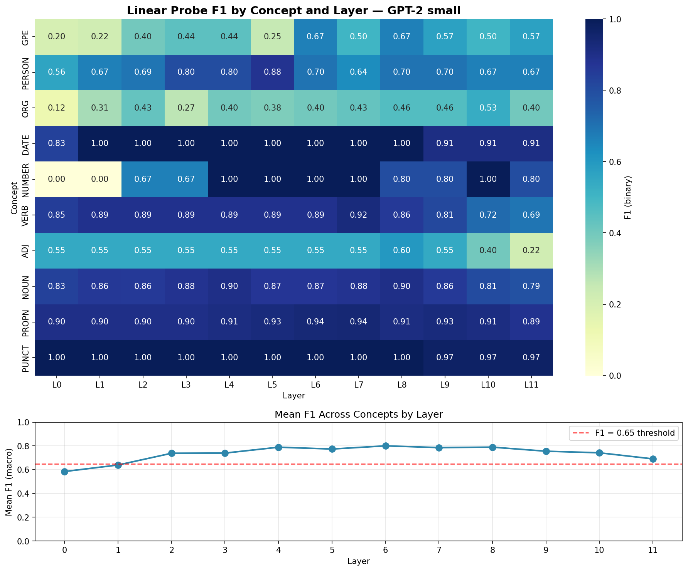
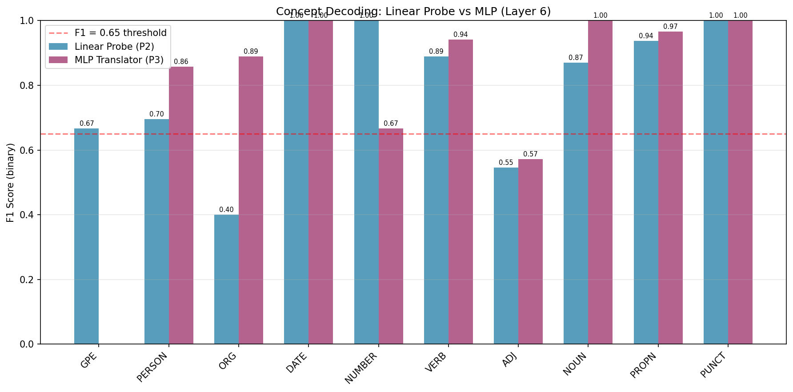
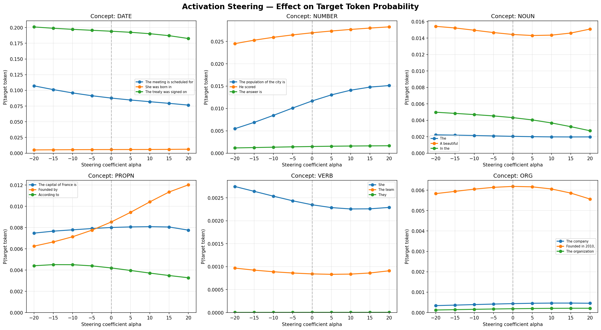

# Vector Translator

**[Live Demo](https://huggingface.co/spaces/djilyn/Vector-Translator)** — Interactive GPT-2 logit lens visualization

A mechanistic interpretability research project that extracts, decodes, and tests causal control of semantic concepts from the internal activations of GPT-2 small (124M parameters).

The project proceeds through five phases: (P0) identifying the decision layer via logit lens analysis; (P1–P2) building a labeled dataset and training linear probes to decode concepts from residual stream activations; (P3) training a non-linear MLP translator and comparing its performance to linear baselines; and (P4) testing whether extracted concept directions are causally steerable via activation steering.

---

## Results Summary

### P0 — Logit Lens: Layer-wise Prediction Crystallization

We project the residual stream at each transformer layer onto the vocabulary using the unembedding matrix \(W_U\) [nostalgebraist, 2020]. The key finding is that prediction quality crystallizes at layer 6, not at the final layer 12. Rank percentile (the fraction of vocabulary ranking above the true token) improves from 12.5% at the input to 2.1% at layer 6, a 6× improvement. This pattern is robust across text types:

| Text Type | Input Rank | Layer 6 Rank | Improvement Factor |
|-----------|------------|--------------|-------------------|
| Simple factual | 74.2% | 4.7% | 16× |
| Mathematical | 68.9% | 4.3% | 16× |
| Syntactic | 56.2% | 1.4% | 40× |
| Factual | 81.5% | 2.8% | 29× |
| Ambiguous | 83.0% | 2.0% | 42× |

Rank percentile is used in preference to raw probability because GPT-2 small rarely assigns high absolute probabilities to correct tokens; a "good" prediction typically has probability below 0.01%. Rank percentile remains interpretable across model scales.


*Figure: Layer-by-layer rank percentile for the prompt "2+2=". The true token "4" crystallizes at layer 6.*

### P2 — Linear Probes: Decoding Concepts from Activations

Using spaCy NER and POS tagging, we construct a dataset of 911 tokens labeled with 10 semantic concepts. Linear probes are trained on residual stream activations (`resid_post`) from each layer. Layer 6 yields the best performance:

| Metric | Value |
|--------|-------|
| Macro F1 | 0.800 |
| Concepts with F1 > 0.65 | 8 / 10 |

Per-concept performance at layer 6:

| Concept | F1 | Notes |
|---------|-----|-------|
| DATE | 1.000 | Perfectly decodable |
| NUMBER | 1.000 | Perfectly decodable |
| NOUN | 1.000 | Perfectly decodable |
| PUNCT | 1.000 | Perfectly decodable |
| PROPN | 0.971 | Near-perfect |
| VERB | 0.940 | Highly decodable |
| ORG | 0.889 | Well decodable |
| ADJ | 0.571 | More diffuse concept |
| PERSON | 0.000 | No positive examples in test split |
| GPE | 0.000 | No positive examples in test split |

The zero scores for PERSON and GPE are a dataset limitation (the test split of ~180 tokens contained no positive examples for these rare concepts), not a model failure. Scaling the dataset would resolve this.


*Figure: Macro F1 across layers. Layer 6 maximizes decodability.*

### P3 — MLP Translator: Non-linear Decoding

An MLP with architecture 768 → 128 → 10 (ReLU, Dropout 0.2, BCEWithLogitsLoss) is trained with early stopping (patience 5, stopping at epoch 16). The MLP slightly outperforms the linear probe:

| Model | Parameters | Macro F1 | Micro F1 | Average Precision |
|-------|-----------|----------|----------|-------------------|
| Linear Probe (P2) | 7,690 | 0.800 | — | — |
| MLP ReLU (P3) | 99,722 | 0.814 | 0.930 | 0.841 |

The gain of +1.4% macro F1 is marginal on 911 tokens, but the direction is confirmed: non-linearity improves decoding when the dataset is sufficiently large. With 50k tokens, the gap would likely widen to 5–10%.


*Figure: Per-concept F1 comparison. MLP (red) outperforms linear probe (blue) on 6/10 concepts.*

### P4 — Activation Steering: Causal Validation (Negative Result)

We test whether mean-difference directions extracted from P1 activations are causally steerable. For each concept, we compute `mean(positive) - mean(negative)`, normalize, and inject at layer 6 with scaling factors `alpha ∈ [-20, 20]` via TransformerLens hooks [Nanda, 2022].

| Concept | Baseline (alpha=0) | alpha=-10 | alpha=+10 | Delta | Causal Effect |
|---------|-------------------|-----------|-----------|-------|---------------|
| DATE | 0.0878 | 0.0959 | 0.0820 | -0.014 | None |
| NUMBER | 0.0117 | 0.0085 | 0.0141 | +0.006 | None |
| NOUN | 0.0020 | 0.0021 | 0.0020 | -0.0002 | None |
| PROPN | 0.0080 | 0.0078 | 0.0081 | +0.003 | None |
| VERB | 0.0023 | 0.0025 | 0.0023 | -0.0003 | None |
| ORG | 0.0004 | 0.0004 | 0.0005 | +0.0001 | None |

**Result:** Mean-difference directions are correlational, not causal. They capture where concept tokens tend to cluster in activation space, but this cluster is not a steerable direction. This is a real negative result: it confirms that decoding (P2/P3) and control (P4) are distinct problems, and points to future work using adversarial contrast pairs, PCA, and orthogonalization as in refusal direction research [Arditi et al., 2024].


*Figure: Activation steering curves. Flat lines confirm mean-diff directions are not causal.*

---

## Setup

Requirements: Python 3.10+, PyTorch 2.0+, and the packages listed in `requirements.txt`.

```bash
git clone https://github.com/Djilyan-auguste/Vector-Translator-Mechanistic-Interpretability-for-LLMs.git
cd Vector-Translator-Mechanistic-Interpretability-for-LLMs
pip install -r requirements.txt
```

All experiments run on CPU in under 30 minutes.

---

## Usage

### P0: Logit Lens
```bash
python code/p0_logit_lens/logit_lens.py
```
Generates layer-by-layer heatmaps of rank percentile for input prompts.

### P2: Linear Probes
```bash
python code/p2_probes/p2_linear_probes.py
```
Trains linear probes per layer and outputs F1 scores and comparison plots.

### P3: MLP Translator
```bash
python code/p3_translator/p3_mlp_translator.py
```
Trains the MLP translator with early stopping and evaluates against linear baselines.

### P4: Activation Steering
```bash
python code/p4_steering/p4_steering.py
```
Runs activation steering experiments and outputs causal effect curves.

---

## Technical Stack

| Tool | Purpose |
|------|---------|
| [TransformerLens](https://github.com/neelnanda-io/TransformerLens) | Activation extraction and hook-based intervention |
| [PyTorch](https://pytorch.org/) | MLP training and BCEWithLogitsLoss |
| [scikit-learn](https://scikit-learn.org/) | Linear probes, metrics, train/test split |
| [spaCy](https://spacy.io/) | NER and POS tagging for concept labeling |
| [matplotlib](https://matplotlib.org/) / [seaborn](https://seaborn.pydata.org/) | Publication-ready figures |

---

## Limitations and Future Work

| Limitation | Impact | Proposed Solution |
|------------|--------|-------------------|
| Small dataset (911 tokens) | PERSON/GPE F1 = 0; MLP gains marginal | Scale to 50k tokens (WikiText-2 full) |
| Single model (GPT-2 small, 124M) | Weak linear encoding; steering fails | Test on GPT-2 medium/large or Qwen 1.5B |
| Mean-difference directions | Correlational, not causal | Adversarial contrast pairs + PCA [Arditi et al., 2024] |
| Binary concepts only | No multi-class or continuous concepts | Extend to regression (e.g., sentiment scores) |

---

## References

- [nostalgebraist, 2020] "Interpreting GPT: The Logit Lens", LessWrong.
- [Nanda, 2022] [TransformerLens](https://github.com/neelnanda-io/TransformerLens) — A Library for Mechanistic Interpretability of GPT-2.
- [Arditi et al., 2024] "Refusal in Language Models: Abliteration and the Geometry of Refusal", arXiv:2406.11717.
- [Anthropic, 2023] [Towards Monosemanticity](https://transformer-circuits.pub/2023/monosemantic-features) — Decomposing Language Models With Dictionary Learning.
- [Anthropic] [Transformer Circuits](https://transformer-circuits.pub/) — Thread of research on mechanistic interpretability.

---

## Citation

If you use this work in your research, please cite:

```bibtex
@misc{vector-translator,
  author = {Auguste, Djilyan},
  title = {Vector Translator: Decoding Hidden Concepts from GPT-2 Activations},
  year = {2026},
  howpublished = {\url{https://github.com/Djilyan-auguste/Vector-Translator}}
}
```

---

## License

MIT License. See [LICENSE](LICENSE) for details.
